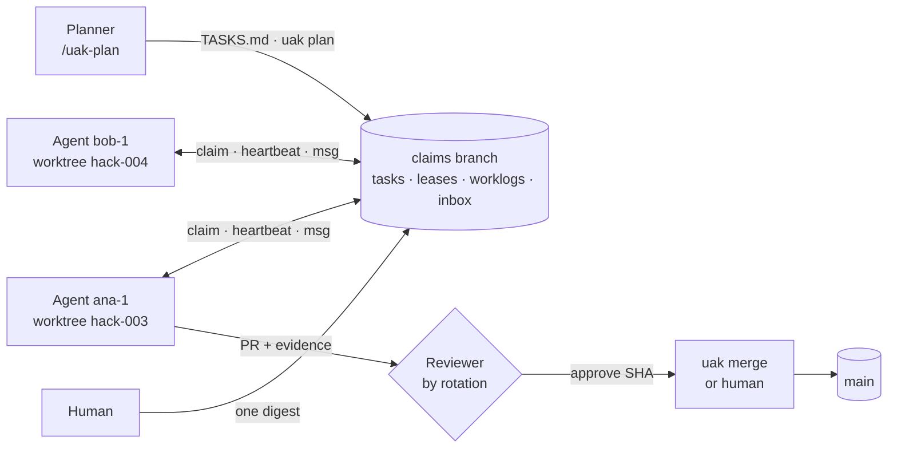

<div align="center">

# UPIIXIA Agentic Kit

### Ship with a team of AI coding agents, in parallel, without chaos.

**Multi-agent coordination for Claude Code, Codex, Cursor and Gemini CLI.** Agents claim tasks, run bounded verify → fix loops, review each other and merge. It works across several humans and machines, with **no server**: just a Git branch and Bash.

**`sprint`** mode wins hackathons · **`marathon`** mode ships secure, scalable products

[](https://github.com/JoahanMorales/upiixia-agentic-kit/actions/workflows/test.yml)


[Quick start](#quick-start) · [Why](#why) · [Modes](#two-modes-one-engine) · [Loop engineering](#loop-engineering) · [Graph engineering](#graph-engineering) · [Token economy](#token-economy) · [Results](#battle-tested-hack-nation-2026) · [Contributing](CONTRIBUTING.md)

</div>

---

## Try it in 30 seconds (no setup, no API key)

```bash
git clone --depth 1 https://github.com/JoahanMorales/upiixia-agentic-kit && bash upiixia-agentic-kit/kit/.uak/bin/uak demo
```
It runs a real 3-agent session in a temp repo with a local Git remote:
- parallel claims, and an overlapping claim rejected;
- a bounded fix loop (`LOOP_FAIL → LOOP_FAIL → LOOP_PASS`);
- a review of the exact SHA by another agent, then a gated merge;
- a dependent task unlocking by itself;
- the team board.

## Quick start

**1. Install into any Git repo** (30 s; needs Bash 3.2+ and Git):

```bash
git clone --depth 1 https://github.com/JoahanMorales/upiixia-agentic-kit ~/.uak-kit
bash ~/.uak-kit/install.sh --mode sprint .          # hackathon / AI prototype
# or: --mode marathon                               # real product: specs, CODEOWNERS, security reviews
# options: --stack fastapi-react   --skills ai,tdd   --update (refresh the engine later)
bash .uak/bin/doctor                                 # minute-0 preflight: remote, gh perms, hooks, freeze, ports
```

**Or, in Claude Code:**

```
/plugin marketplace add JoahanMorales/upiixia-agentic-kit
/plugin install uak@upiixia-agentic-kit
/uak:setup
```

**2. Plan:** open your agent in the repo and run `/uak-setup`, then `/uak-plan`. Codex, Cursor and Gemini read `AGENTS.md` natively.

**3. Start the team:**

```bash
bash .uak/bin/uak up 4 --tmux                 # claim the 4 best tasks, one worktree + agent each (tmux)
# or one agent at a time:
bash .uak/bin/wt new HACK-003 --agent ana-1   # branch + worktree + identity + port + claim
bash .uak/bin/uak board --watch 10            # live team kanban for the humans
```

That's it. `uak next` always tells every agent what to do next.

## Why

One agent in one terminal is easy. **Five agents run by four people on three machines** is chaos:

- two agents edit the same file;
- one runs out of tokens while holding the task everyone waits on;
- a force-push wipes a teammate's work;
- the human becomes a traffic light for every merge.

This kit is the protocol we used to ship **76 PRs in ~14 hours with 5 agents and 4 humans** at Hack-Nation 2026, rebuilt from a data-driven post-mortem of everything that went wrong ([retro](docs/RETRO-hacknation-2026.md)).

| Without the kit | With the kit |
|---|---|
| "Who's on the login page?" | `uak next`: one eligible task per agent, with path overlap rejected at claim time |
| An agent dies and its work is stranded | Leases + a 6-line live summary: the next agent resumes from the exact next step |
| Agents loop forever on a failing test | Bounded loops: 5 attempts, stuck detection, then escalate with the exact error |
| `cd x && git push --force` | Blocked by a hook, even when chained |
| An API key pasted into the chat | Blocked before the model ever sees it |
| The human merges 75 PRs by hand | Reviewer rotation + an auto-merge queue that re-runs every gate (sprint) |
| "Did anyone check that it works?" | Every PR has a reviewer who is not the author and who **runs** Verify on the exact SHA |

## Two modes, one engine

| | `sprint` (hackathon, AI prototype) | `marathon` (real product) |
|---|---|---|
| Optimizes | demo wow per hour, a stunning frontend | correctness, security, scale |
| Planning | IDEA → rubric → vertical P0 tasks | constitution → spec (EARS) → plan + threat model → tasks |
| Backlog changes | `uak plan` publishes instantly (no PR) | reviewed PR |
| Merge | auto-merge after review and green gates | human CODEOWNERS + required CI; agents pre-review |
| Frontend | design lock at T+1h, `design-critic` on 1280×720 screenshots | perf budgets, accessibility in CI |
| Safety net | mandatory freeze at T−6h, plan-B video, human owns submission | `security-reviewer`, dependency decisions, ADRs, TDD |
| Lease / review wait | 45 min / 4 h | 4 h / 24 h |

The mode is one line, `Mode:` in `.uak/PROJECT.md`. Rules: [`AGENTS.md`](kit/AGENTS.md) · [sprint](kit/.uak/modes/sprint.md) · [marathon](kit/.uak/modes/marathon.md).

## How it works



- **The `claims` branch is the database.** Every state change is a commit pushed fast-forward. Races resolve like Git does: fetch, rebase, re-validate, retry. It works across machines, people and tools.
- **Path reservations.** Tasks declare `Paths`. Overlapping claims are rejected, and shared files (lockfiles, schemas, CI) need an owner.
- **Typed async inbox.** `contract`, `request`, `review`, `approve`, `reject`. Hooks inject only the actionable messages into the agent's context.
- **Guards.** A `PreToolUse` hook blocks destructive Git, `sudo`, `.env` reads and publishing. A `UserPromptSubmit` hook blocks pasted secrets.

## Loop engineering

Every loop declares a **trigger, a verifier, a budget, a stop condition and an escalation**, or it isn't allowed ([LOOPS.md](kit/.uak/docs/LOOPS.md)).

```bash
# An unattended, bounded fix loop. Works with any CLI agent that reads a prompt on stdin.
bash .uak/bin/uak loop --verify "uv run pytest -q" --agent "claude -p --permission-mode acceptEdits" --max 5 --task HACK-007
# LOOP_FAIL iteration=1 exit=1 · test_api.py::test_search FAILED
# LOOP_PASS iteration=2 · 12 passed in 1.9s
```

- **Inner loop** (`/uak-loop`): implement → `q verify` → fix; 5 tries; the same error twice → BLOCKED with that error.
- **Hook loops:** a heartbeat every 8 min and an inbox poll every 2 min, both throttled and in the background.
- **Review loop:** `done` → reviewer by rotation → approve or reject → merge queue.
- **Deadline loop:** decisions resolve after 15 min (routine only), backlog P0s after 10 min, freeze on schedule.
- Failures are fed back as a 40-line tail, never full logs. Agent output goes to a log file, never into your context.

## Graph engineering

A team of agents is a graph: **members, mandates, message paths, shared state, routing, traceability**. Every edge here is a file or a command ([GRAPH.md](kit/.uak/docs/GRAPH.md)).

```bash
bash .uak/bin/uak graph --min-wave1 4
# GRAPH 9 tasks · 3 waves · critical path 135 min: HACK-002 → HACK-006 → HACK-009
# wave 1 (5): HACK-001 HACK-002 HACK-003 HACK-004 HACK-005
bash .uak/bin/uak graph --mermaid      # live state colors, paste into any PR or issue
```

`uak lint` fails on dependency cycles and unknown IDs. `Uses contract:` edges let consumers work on mocks instead of waiting.

## Token economy

Tokens are the scarcest resource of an agent team. Every default is tuned to spend fewer of them:

- `AGENTS.md` is **60 lines**, lint-capped at 100. Detail loads on demand from a trigger table.
- `q` turns a 2,000-line test log into **one line** on success, or a 40-line tail on failure.
- Noisy work runs in **subagents** (a Haiku runner, a Sonnet reviewer); only a summary comes back.
- Only **actionable messages** are injected. Duplicate broadcasts are gone: 194 of 717 messages in our event were noise.
- Skills are installed **per mode**: each installed skill's description costs tokens in every session.
- One task = one session, a 6-line handoff, and `/clear`. Compaction keeps only ID, next step, failures and commands.

## Battle-tested: Hack-Nation 2026

5 agents, 4 humans, 3 machines (one a Jetson Orin Nano), 76 PRs in ~14 h. Every v3 rule cites the incident behind it ([WHY.md](kit/.uak/docs/WHY.md)).

| What happened | Fix |
|---|---|
| The secret scanner silently detected **nothing** all event: Ubuntu's `mawk` ignores regex `{n}` | `grep -E` rules, a regression test, a `doctor` check |
| A force-push slipped past the deny list when chained with `&&` | `guard` parses every command segment |
| A teammate pasted an API key and a sudo password into chat | `guard prompt` blocks it before the model sees it |
| 194 of 717 messages were duplicate notices | one notice per owner; non-actionable kinds summarized |
| 38 lease recoveries, mostly tasks just waiting for review | mode-aware leases; REVIEW waits 4× longer |
| 8 PRs only added tasks to the backlog | `uak plan` publishes to the claims branch |
| 2 agents gave 51 of 70 review verdicts; the busiest agent (247 of 717 messages) ran out of tokens | reviewer rotation by load |
| No freeze: 8 PRs and a product rename in the last 6 h | freeze is mandatory in sprint; `/uak-design-lock` |

**70+ integration tests** run against real Git processes and local bare remotes, in CI on Linux (mawk) and macOS (BSD awk): `cd kit && bash .uak/bin/smoke --package-only`.

## Works with
| Tool | How |
|---|---|
| **Claude Code** | full support: hooks (guard, prompt guard, heartbeat, inbox), slash commands, subagents, skills, plugin |
| **Codex CLI** | reads `AGENTS.md`; skills via `.agents/skills`; `uak loop --agent "codex exec -"` |
| **Cursor** | `.cursor/rules/uak.mdc` + `.cursor/skills`; manual heartbeat and `guard check` |
| **Gemini CLI, Aider, any agent** | `AGENTS.md` + the `uak` CLI; `uak loop --agent '<cli reading stdin>'` |

Mix them freely: coordination lives in Git, not in any tool.

## Commands
| Command | What |
|---|---|
| `uak demo` | see everything in 30 s |
| `uak next` | what you should do now |
| `wt new ID --agent NAME` | start a task (branch, worktree, port, claim) |
| `uak loop --verify CMD` | bounded autonomous fix loop |
| `uak graph [--mermaid]` | backlog DAG: waves, critical path, cycles |
| `uak done` / `review` / `merge` | ship → review by rotation → gated merge queue |
| `uak up N [--tmux]` | claim the N best tasks and launch one agent per worktree |
| `uak board [--watch] [--md]` | team kanban: state, owner, lease, PR, wave |
| `uak stats` | retro numbers: messages, reviews, recoveries, merge queue |
| `uak demo` | the 30-second real 3-agent run |
| `uak msg` / `inbox` / `digest` | agent messages · the human's single summary |
| `uak plan FILE` | publish new tasks instantly (sprint) |
| `uak doctor` | preflight everything at minute 0 |
| `q CMD` | quiet runner (one line on success) |

Full reference: [CLI.md](kit/.uak/docs/CLI.md). Example backlog: [examples/ai-hackathon](examples/ai-hackathon/). Slash commands: `/uak-setup`, `/uak-plan`, `/uak-start`, `/uak-loop`, `/uak-ship`, `/uak-review`, `/uak-handoff`, `/uak-retro`, plus `/uak-design-lock` and `/uak-demo` (sprint) and `/uak-spec` (marathon).

## What's inside
```
AGENTS.md · CLAUDE.md        60-line core every agent reads · Claude Code extras
.uak/bin/                    uak CLI, wt, loop, graph, guard, doctor, q, secret-scan (Bash 3.2, no jq)
.uak/modes/                  sprint.md · marathon.md
.uak/docs/                   CLI · PROTOCOL · LOOPS · GRAPH · SECURITY · WHY
.uak/templates/              PROJECT, TASKS, OWNERS, IDEA, spec, plan, ADR
.uak/skills/                 curated skills (superpowers, Anthropic, Vercel, taste-skill), pinned, licensed
.uak/stacks/fastapi-react/   optional stack preset
.claude/                     slash commands, subagents, hooks (settings per mode)
```

## How it compares

They are complementary: use them for planning or UI, and this kit for coordinating many agents and humans.

| | This kit | Spec Kit / BMAD / Task Master | claude-squad / vibe-kanban | Swarm frameworks |
|---|---|---|---|---|
| Many humans × many agents × many machines | **yes, via Git** | one human | one machine | one machine / runtime |
| Server, daemon or app to install | **none** (Bash + Git) | CLI or npm | app or tmux | runtime |
| Claims with path overlap rejection and leases | **yes** | — | worktree isolation | varies |
| Independent review of the exact SHA + gated merge | **yes** | — | manual | varies |
| Bounded loops (budget, stuck detection, escalation) | **yes** (`uak loop`) | — | — | varies |
| Task DAG checks (waves, critical path, cycles) | **yes** (`uak graph`) | Task Master: deps | — | varies |
| Hackathon vs product modes | **yes** | — | — | — |
| Guards against force-push and pasted secrets | **yes** | — | — | — |

## FAQ
**Do I need a server, a database or an API key?** No. Bash, Git and a remote (GitHub, GitLab, or even a bare repo on a USB drive). `gh` is optional.

**How is this different from Spec Kit, BMAD or Task Master?** They structure **one** human's work with agents. This kit coordinates **many humans and agents in parallel**: claims, leases, reviews, merges. It borrows the best of those for planning ([INSPIRATIONS](docs/INSPIRATIONS.md)).

**And from agent orchestrators or swarms?** They spawn agents on one machine. This kit has no daemon: any agent, anywhere, coordinates through `git push`.

**Windows?** Yes, with Git Bash. macOS ships Bash 3.2, which is supported.

**Is the guard a sandbox?** No. It is defense in depth against accidents. For untrusted agents, use your tool's sandbox as well.

## Contributing
PRs are welcome, especially stack presets, an i18n locale, new loop and graph checks, and retros from your own hackathon. Read [CONTRIBUTING.md](CONTRIBUTING.md): every rule needs evidence, and every engine change needs a test.

## License
MIT © Joahan Morales and contributors. Vendored skills keep their licenses ([SOURCES](kit/.uak/skills/SOURCES.md)).

<sub>Keywords: multi-agent coding, AI agent team, Claude Code multi-agent, Codex, Cursor, Gemini CLI, AGENTS.md, git worktrees, parallel agents, loop engineering, graph engineering, agentic workflow, hackathon kit, spec-driven development, AI pair programming, agent coordination, vibe coding guardrails.</sub>
