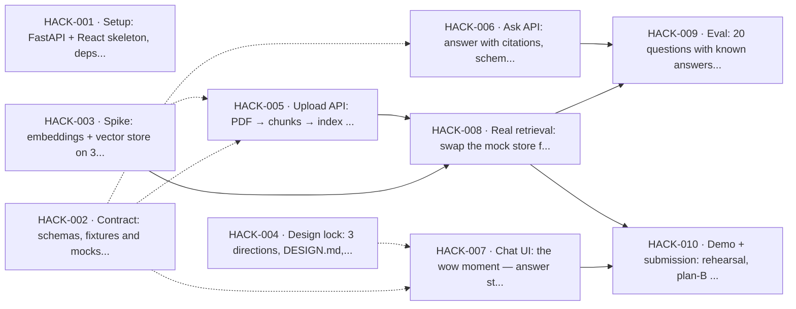

# DocTalk backlog graph (generated by `uak graph --mermaid`)

```mermaid
flowchart LR
  HACK_001["HACK-001 · Setup: FastAPI + React skeleton, deps..."]
  HACK_002["HACK-002 · Contract: schemas, fixtures and mocks..."]
  HACK_003["HACK-003 · Spike: embeddings + vector store on 3..."]
  HACK_004["HACK-004 · Design lock: 3 directions, DESIGN.md,..."]
  HACK_005["HACK-005 · Upload API: PDF → chunks → index ..."]
  HACK_006["HACK-006 · Ask API: answer with citations, schem..."]
  HACK_007["HACK-007 · Chat UI: the wow moment — answer st..."]
  HACK_008["HACK-008 · Real retrieval: swap the mock store f..."]
  HACK_009["HACK-009 · Eval: 20 questions with known answers..."]
  HACK_010["HACK-010 · Demo + submission: rehearsal, plan-B ..."]
  HACK_002 -.-> HACK_005
  HACK_003 -.-> HACK_005
  HACK_002 -.-> HACK_006
  HACK_002 -.-> HACK_007
  HACK_004 -.-> HACK_007
  HACK_003 --> HACK_008
  HACK_005 --> HACK_008
  HACK_008 --> HACK_009
  HACK_006 --> HACK_009
  HACK_007 --> HACK_010
  HACK_008 --> HACK_010
  classDef integrated fill:#d1fadf,stroke:#16a34a
  classDef claimed fill:#dbeafe,stroke:#2563eb
  classDef review fill:#fef9c3,stroke:#ca8a04
  classDef blocked fill:#fee2e2,stroke:#dc2626
```
